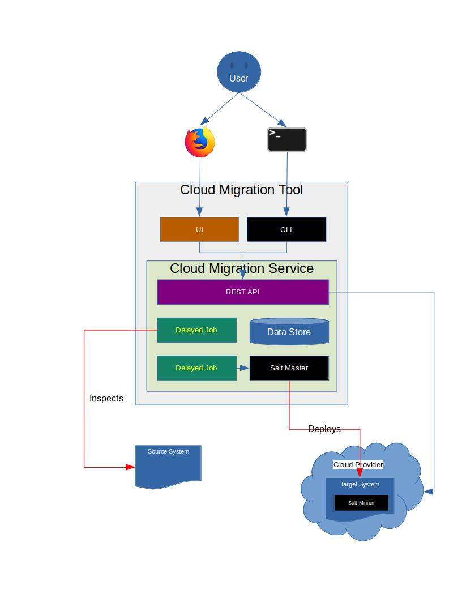

================================
Cloud Migration REST API Service
================================

Cloud Migration REST API Service, as the name implies, implements the
Cloud Migration Tool REST API layer, as depicted in the architecture
diagram below.

|architecture|

Cloud Migration Tool is designed to enable users to easily migrate their
on-premises (or on-prem) workload, whether its running on baremetal
or VM, into the Public Cloud. Cloud Migration REST API Service is the main
engine which orchestrating the entire migration process. It enables users to
do the following:

1. inspect the source system for artifacts such as operation system
   information, users, groups, packages, patterns, configuration files,
   managed files, unmanaged files, and services. The inspection is utilizing
   the `Machinery <https://github.com/SUSE/machinery.git>`_ under the hood.
   The inspection is asynchronous.
2. customize the inspection to narrow down the artifacts to be migrated.
3. inject artifacts (i.e. SSL certificates) which may be system-specific and
   must be replaced in the target VM.
4. export the inspeciton to Salt states, which will be applied to the target
   VM.
5. create a migration plan for the Cloud Provider which consisted of target VM
   information (i.e. image ID, network, security group, SSH key, storage, etc)
   and the Salt export to be applied. Once the migration plan is create, the
   Cloud Migration REST API Service will automatically start the migration
   process in the backgroup. The migration process is asynchronous.

See `doc/curl_examples.txt <doc/curl_examples.txt>`_ for REST API examples.

=======================
Development Environment
=======================

Cloud Migration REST API Service is based on Ruby on Rails framework. The code
have been tested with Ruby 2.5.8 on openSUSE Leap 15.2.

To setup a local development:

1. Clone the `cloud-migration repo <https://github.com/SUSE/cloud-migration.git>`_
2. Install the following packages: ruby-devel, ruby2.5-rubygem-rails-5_1,
   sqlite3-devel, sqlite3, make, gcc, gcc-c++, go, ruby2.5-rubygem-execjs,
   and zlib-devel

3. Install the required Ruby gems.

   .. code-block::

     bundle install --path vendor

4. cd into cloud-migration root directory and run the following to create
   the database.

   .. code-block::

     rails db:migrate
     rails db:seed

5. Create a systemd script, cloud-migration-delayed-job.service, in
   /etc/systemd/system/ with the following content.

   .. code-block::

     [Unit]
     Description=Cloud Migration Delayed Job service.

     [Service]
     Type=forking
     User=root
     Group=root
     Environment=RAILS_ENV=development
     WorkingDirectory={{ cloud_migration_install_dir }}
     ExecStart={{ cloud_migration_install_dir }}/bin/delayed_job start --pid-dir=/tmp/pids/
     ExecStop={{ cloud_migration_install_dir }}/bin/delayed_job stop --pid-dir=/tmp/pids/
     TimeoutSec=120
     Restart=always
     RestartSec=3

     [Install]
     WantedBy=multi-user.target

   Replace *{{ cloud_migration_install_dir }}* with the complete path to the
   cloud-migration root directory.

6. Start the Cloud Migration REST API server by running

   .. code-block::

     ./bin/restart_server.sh

   You must restart the server everytime you make code changes in the project.

